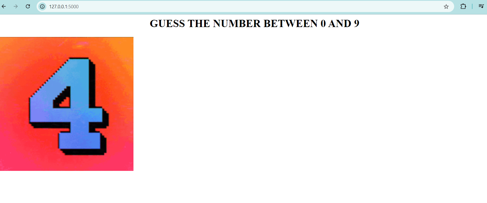
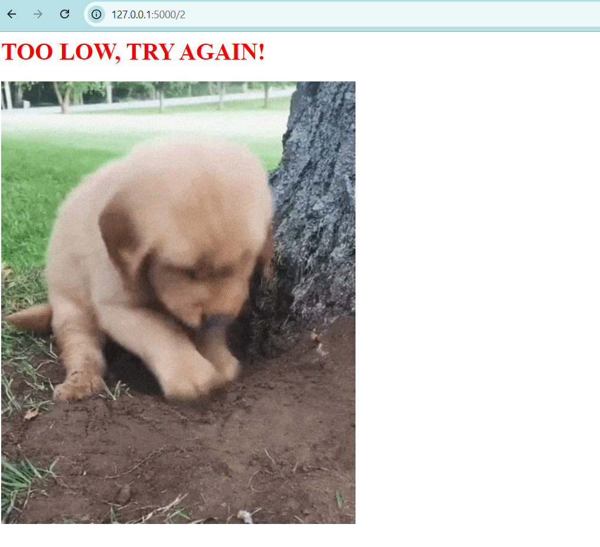
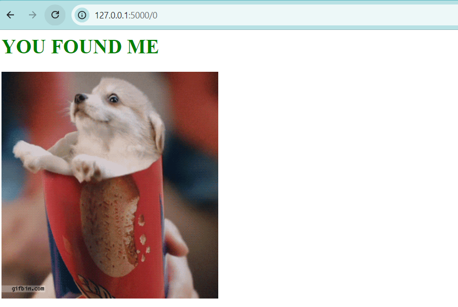
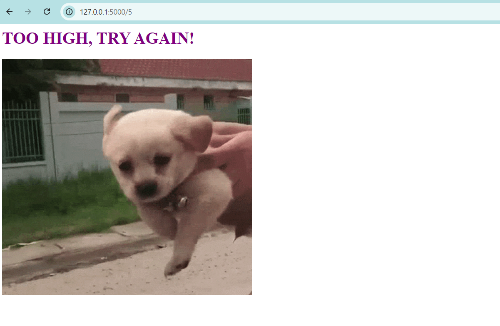

# Higher or Lower Number Guessing Game

This is a simple web-based number guessing game built with Flask. In this game, a random number is generated between 0 and 9, and the player has to guess the correct number. The app provides feedback on whether the guess is too high, too low, or correct!

## Demo
Visit the home page to start playing:  
- Homepage - Displays the prompt for guessing a number.
 
  
## How It Works
- The server generates a random number between 0 and 9 at the start.
- The player makes a guess by visiting the URL `/<guess>` where `<guess>` is a number between 0 and 9.
- The app provides feedback based on the player's guess:
  - **Too High**: If the guessed number is higher than the random number.
  - **Too Low**: If the guessed number is lower than the random number.
  - **Correct**: If the guessed number matches the random number.

## Setup Instructions
1. **Clone the repository:**
    ```bash
    git clone https://github.com/shrutimsontakke/higher-lower-game.git
    cd higher-lower-game
    ```

2. **Create a virtual environment and activate it:**
    ```bash
    python3 -m venv venv
    source venv/bin/activate  # For Windows: venv\Scripts\activate
    ```

3. **Install the required packages:**
    ```bash
    pip install flask
    ```

4. **Run the application:**
    ```bash
    python app.py
    ```

5. Open your browser and visit `http://127.0.0.1:5000` to play the game!

## Files in this Repository
- **app.py**: Main application code.
- **README.md**: Documentation for the project.

## Project Structure
```
higher-lower-game/
│
├── app.py           # Main Flask application
└── README.md        # Project documentation
```

## Technologies Used
- **Flask**: Python micro-framework for building web applications.
- **HTML**: Used for the structure and content of the web pages.
- **GIFs**: For providing visual feedback for each type of guess.

## Results

  

  

  

## Acknowledgements
- Thanks to [Giphy](https://giphy.com/) for the GIFs used in this project.


